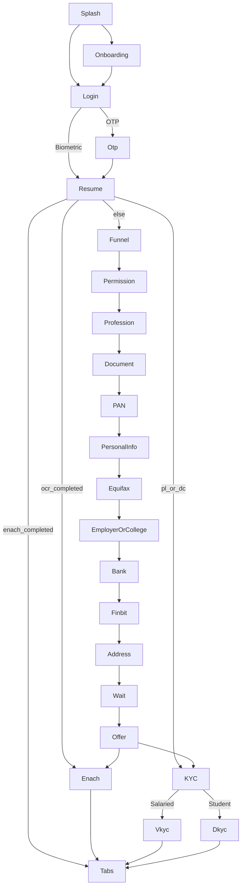
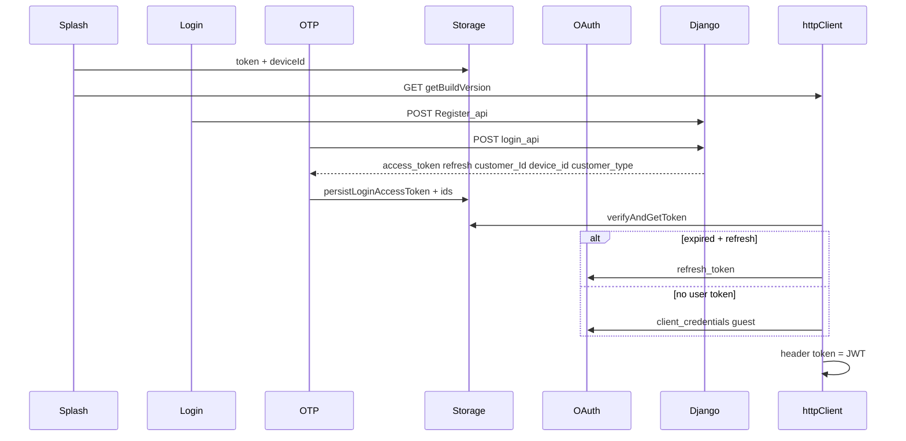

# ZapMoney React Native → Flutter Migration Report

**Phase 0 artifact** — analysis only; no Flutter feature code yet.

| Field | Value |
|-------|-------|
| Source of truth | `zap-money-frontend/master` only |
| Sibling folders | Out of scope (`devuat`, `build77`, `moengage`, etc.) |
| Backend | Django + Monexo gateway — **do not modify** |
| Delivery | New app at `zap-money-frontend/zap_money_flutter/` (RN untouched until parity) |
| Deferred SDKs | Flyy Rewards UI, Salesforce Marketing Cloud (stub in Flutter v1) |
| Stack target | Riverpod, Dio, GoRouter, Freezed, flutter_secure_storage, Clean Architecture |
| Report date | 2026-07-28 |

---

## 1. Folder structure (RN `master/src`)

```
src/
├── index.js                 # App entry → AppNavigator
├── alias/                   # @alias barrel re-exports
├── appRedux/
│   ├── actions/             # UserType, loading, dkyc
│   ├── reducers/
│   └── store/
├── assets/
│   ├── Fonts/               # Digreto Neue + Cash Display
│   ├── images/              # ~150 PNGs
│   ├── lottie/              # 7 JSON animations
│   ├── index.js
│   └── path.js              # require() image map
├── components/
│   ├── atoms/               # Shared UI
│   ├── database/            # Realm schemas + useDatabase
│   └── sync/                # Device data sync hooks
├── constants/               # api, baseurl, messages, theme, app
├── navigation/              # Stack + tabs + ScreenName
├── scenes/                  # Feature screens (~41 scene folders)
├── services/                # HTTP, auth, Firebase, SDKs
├── styles/                  # typography, spacing, themes, mixins
└── utils/                   # validation, helper, alerts
```

Native projects: `android/`, `ios/` (package id `com.zapmoney`).

---

## 2. Screen inventory

From `src/navigation/ScreenName.js` + `app-navigator.js`.

| ScreenName key | Route string | Scene path | Purpose |
|----------------|--------------|------------|---------|
| splashScreen | SplashScreen | `scenes/splash` | Launch, version check, session bootstrap |
| onboarding | OnBoarding | `scenes/onboarding` | First-run carousel |
| login | Login | `scenes/login` | Mobile login / OTP send |
| otp | Otp | `scenes/otp` | OTP verify + ScreenStatus resume |
| permission | permission | `scenes/permission` | OS permissions + background sync setup |
| privacyPolicy | PrivacyPolicy | `scenes/privacyPolicy` | Privacy policy |
| profession | Profession | `scenes/profession` | Student / salaried / business |
| document | Document | `scenes/document` | ID document checklist |
| pancardInfo | PancardInfo | `scenes/pancardinfo` | PAN / DL / voter |
| personalInformation | PersonalInformation | `scenes/personalInfo` | Name, email, Aadhaar, etc. |
| equifax | Equifax | `scenes/equifaxReport` | Bureau pull / report |
| prequalifiedoffer | Prequalifiedoffer | `scenes/equifaxReport/preQualifiedOffer` | Pre-qualified offer |
| employerDetails | EmployerDetails | `scenes/employerDetails` | Employer + payslip (salaried) |
| collegeDetails | CollegeDetails | `scenes/collegeDetails.js` | College + docs (student) |
| bankDetails | BankDetails | `scenes/bankDetails.js` | Bank / IFSC |
| bankStatement | BankStatement | `scenes/bankStatement` | Statement PDF upload |
| finbit | Finbit | `scenes/finbit` | Finbit WebView AA/netbanking |
| residenceAddress | residenceAddress | `scenes/ResidenceAddress` | Residence address |
| addressSelection | AddressSelection | `scenes/ResidenceAddress/addressSelection` | Address pick |
| notServingLocation | notServingLocation | `scenes/notServingLocation` | Geo not served |
| waitingScreen | WaitingScreen | `scenes/waitingScreen` | Credit decision wait |
| referredScreen | ReferredScreen | `scenes/referredScreen` | Referred wait state |
| rejectedScreen | RejectedScreen | `scenes/Rejected` | Application rejected |
| salariedOffer | SalariedOffer | `scenes/offerScreen/salaried` | Salaried offer |
| studentOffer | StudentOffer | `scenes/offerScreen/student` | Student offer |
| loanConfirmed | LoanConfirmed | `scenes/offerScreen/loanConfirmed` | Offer accepted |
| vkyc | Vkyc | `scenes/vkyc` | Video KYC (salaried, external URL) |
| Dkyc | Dkyc | `scenes/Dkyc` | DigiLocker KYC (student) |
| enach | Enach | `scenes/enach` | eNACH mandate hub |
| upi | Upi | `scenes/upi` | Enter VPA |
| upiMandate | UpiMandate | `scenes/upi/createMandate` | Create UPI mandate |
| upiRequestApprove | UpiRequestApprove | `scenes/upi/waitingScreen` | Poll approval |
| upiMandateRegistered | UpiMandateRegistered | `scenes/upi/upiSuccess` | UPI success |
| upiMandateRegisteredFailed | upiMandateRegisteredFailed | `scenes/upi/upiFailed` | UPI fail |
| upiAddDebitCard | UpiAddDebitCard | `scenes/upiAddDebitCard` | Legacy/incomplete |
| emailVarification | EmailVarification | `scenes/emailVarification` | Email verify |
| bottom | Bottom | Tab navigator | Main shell |
| home | Home | `scenes/home` | Dashboard |
| creditScore | CreditScore | `scenes/CreditScore` | Credit score tab |
| reward | Reward | `scenes/reward` | Rewards (Flyy intercept) |
| learn | Learn | `scenes/learn` | Learn / Discount tab |
| profile | Profile | `scenes/profile` | Profile hub |
| personalDetailProfile | PersonalDetailProfile | `scenes/profile/personalDetail` | Edit personal |
| employerDetailsProfile | EmployerDetailsProfile | `scenes/profile/...` | Edit employer |
| salaryDetailProfile | SalaryDetailProfile | profile | Salary docs |
| addressProfile | AddressProfile | profile | Address |
| bankDetailProfile | BankDetailProfile | profile | Bank |
| profileImageSelect | ProfileImageSelect | `scenes/profileImageSelect` | Avatar |
| loanApply | LoanApply | `scenes/applyLoan` | Apply loan |
| loanDetails | LoanDetails | `scenes/Loans/LoanDetails` | Loan detail / EMI |
| loanTransactions | LoanTransactions | `scenes/Loans/LoanTransaction` | Transactions |
| noLoans | Noloans | `scenes/Loans/NoLoans` | Empty loans |
| loanStageModal | loanStageModal | atoms | Stage modal |
| imgController | ImgController | `scenes/imgcontroller` | Camera/gallery modal |
| demo | Demo | `scenes/demo` | Demo placeholder |
| (hardcoded) | Signup | `scenes/signup` | Signup → login |

**Bottom tabs:** Home | Credit Score | Discount (Learn) | Reward (Flyy `openRewardsScreen` + preventDefault) | Learn.

---

## 3. Navigation flow

### Architecture

- Root: `NavigationContainer` + `NativeStackNavigator` (`initialRouteName = SplashScreen`)
- Main shell: `Bottom` = `createBottomTabNavigator`
- Imperative nav: `global.navRef` via `handle-navigation.js` (`handlePush`, `handleSetRoot`, etc.)

### Happy-path funnel

```
Splash (3s)
  ├─ token + deviceId → Login (biometric resume path)
  └─ else → OnBoarding → Login
Login → OTP (Register_api) → login_api → ScreenStatus resume ladder
Permission → Profession → Document → PancardInfo → PersonalInformation → Equifax
  ├─ Salaried: EmployerDetails → BankDetails → BankStatement/Finbit → residenceAddress
  │            → WaitingScreen → SalariedOffer → LoanConfirmed → Enach / Vkyc → Bottom
  └─ Student:  CollegeDetails → BankDetails → … → StudentOffer → Enach / Dkyc → Bottom
```

### ScreenStatus resume ladder (must preserve order)

Flags in `src/services/ScreenStatus.js`. Written via `POST /UpdateScreenStatus` (`newScreenCompletionflags`). Read via `POST /ScreenStatus`.

| Priority | Flag constant | Flag string | Destination |
|----------|---------------|-------------|-------------|
| 1 | Enach | `enach_completed` | Bottom (Home) |
| 2 | Ocr | `ocr_completed` | Enach |
| 3 | PL / DC | `pl_completed` / `dc_completed` | KYC check → Bottom / Vkyc / Dkyc |
| 4 | AddressSelection | `addressSelection_completed` | WaitingScreen |
| 5 | Finbit + BankDetails | `finbit_completed` + `bankdetails_completed` | residenceAddress |
| 6 | College / Employer | `collegedetails_completed` / `employerdetails_completed` | BankDetails |
| 7 | Equifax | `equifax_completed` | Rejected (plan 0) OR Employer/College |
| 8 | PersonalInfo | `personalinfo_completed` | Equifax |
| 9 | Permission | `permissionGranted` | Profession |
| 10 | else | — | Permission |

Also: `bankdetails_verified`, `vkyc_completed`, `registered_as_lender`.



---

## 4. API endpoints

**Config:** `src/constants/api.js` + `src/constants/baseurl.js` (no `.env` / react-native-config).

### Hosts (flags in `BaseURL`)

| Flag | Role |
|------|------|
| `isProd` | Django borrower API host |
| `isProdSetu` | Setu payment links |
| `isProdFinbit` | Finbit URLs + credentials |
| `isProdKarza` | Karza + Flyy partner id |
| `isProdKyc` | Declared (HyperSnap keys use `isProd`) |

| Host key | Non-prod (current `isProd=false`) | Prod |
|----------|-----------------------------------|------|
| `BASEURL` (Django) | ngrok UAT host in source | `http://borrowerapi.monexo.co:8000` |
| `BASE_URL_MONEXO` | `http://uat-monexo-gateway-service.monexo.co` | same UAT in both branches today |
| Security OAuth | `http://uat-monexo-security-service.monexo.co` | hardcoded |

**Gateway prefixes:**

- Python: `{BASE_URL_MONEXO}/gateway/newmapi`
- PHP: `{BASE_URL_MONEXO}/gateway/newapi`
- Offers: `.../gateway/offerservice`
- Fly config: `.../gateway/feature-configuration/v1/fly`

**Broken refs in RN:** `BaseURL.LOTUSPAY_MANDATE` and `BaseURL.lotusPayKey` used in `api.js` but **not defined** in `baseurl.js`.

### Auth header contract (critical)

| Client | File | Content-Type | Auth |
|--------|------|--------------|------|
| httpClient | `services/httpClient.js` | JSON | header **`token`** (not Bearer) |
| httpClientV1 | `services/httpClientV1.js` | JSON | `token` |
| httpClientUpload | `services/httpClientUpload.js` | multipart | `token` |
| httpClientUploadV1 | `services/httpClientUploadV1.js` | multipart | `token` |

Request flags: `lockToken` (skip JWT / avoid deadlock), `clearHeader` (Karza/LotusPay). Some endpoints also send `Authorization: Bearer` (digilocker, bank update, Equifax profile).

### Django borrower API (`ApiEndpoints.url`)

| Method | Path | Notes / callers |
|--------|------|-----------------|
| POST | `/Register_api/` | Send OTP (`validateDevice`) |
| POST | `/login_api/` | Verify OTP |
| POST | `/verify-mobile-number/` | Profile mobile update |
| POST | `/saveAppsflyerId/` | AppsFlyer UID |
| POST | `/sendflyEvent` | Flyy event mirror |
| POST | `/ScreenStatus` | Get completion flags |
| POST | `/UpdateScreenStatus` | Set flag |
| POST | `/update_Screen` | Home |
| POST | `/HomeScreenInformation` | Home |
| POST | `/LoanStatus` | Loan detail |
| POST | `/customerInformation` | Address / profile |
| POST | `/GetSFAccountStatus` | SF status |
| POST | `/GetPaymentLinkInformation` | Fee links |
| POST | `/GetCreditDecisionInformation` | Credit decision |
| POST | `/getCustomerInfo` | Credit decision details |
| POST | `/SourceId` | Source id |
| POST | `/getLocationDetails/` | Location |
| POST | `/get_location_decision` | Location decision |
| POST | `/getContactsDetails/` | Contacts |
| POST | `/verify_user_email/` | Email verify/update |
| POST | `/StoreBankInfo` | Store bank |
| POST | `/GetBankAccountInformation` | Get bank |
| POST | `/update-bank/` | Update bank (+ Bearer) |
| POST | `/finbitBankVerification` | Finbit BAV |
| POST | `/finbitTokenGeneration` | Finbit URL token |
| POST | `/finbitUploadStatement` | Finbit upload meta |
| POST | `/uploadFinbitBankStatement` | Upload statement |
| POST | `/StoreEmpInfo` | Employer / student emp |
| POST | `/StoreOfficeAddress/` | Office address |
| POST | `/CreditDecision` | Run decision |
| POST | `/pullCreditBureau` | Bureau |
| POST | `/validatescore` | Score validate |
| POST | `/pullEquifaxProfile` | Equifax (+ Bearer) |
| POST | `/freeCreditScore` | Free score |
| POST | `/Monthly_credit_score` | Monthly score |
| POST | `/StoreSetuPaymentLink` | Setu link store |
| POST | `/StoreSetuPaymentResponse` | Setu response |
| POST | `/CashfreeEmiPayment` | EMI pay |
| POST | `/cashfree-emi-payment-success` | EMI status |
| POST | `/createKycLink` | Video KYC URL |
| POST | `/digilockerCreateUrl` | DigiLocker URL |
| GET | `/digilockerStatus` | DigiLocker poll |
| POST | `/digilockerComplete` | DigiLocker complete |
| POST | `/eAadhaarDetails` | eAadhaar |
| POST | `/VkycResponseCheck` | VKYC status |
| POST | `/dkycFrontendResponse` | Persist DKYC |
| POST | `/StoreFinalOfferSelection` | Final offer |
| POST | `/GetFinalOfferSelection` | Get final offer |
| POST | `/StoreOfferSelection` | Offer select |
| POST | `/GetPartnerDetails` | Partner |
| POST | `/PartnerStatus` | Partner status |
| POST | `/calculateEmi` | EMI calc |
| GET | `/MonexoFees` | Fees |
| POST | `/enachSourceIdCreation` | eNACH source |
| POST | `/EnachSourceIdCreation` | eNACH source (alt) |
| GET | `/EnachSourceCreation` | eNACH get |
| POST | `/checkSourceStatus` | Source status |
| POST | `/StoreCustomerMandateSource` | Mandate source |
| POST | `/StoreCustomerMandateStatus` | Mandate status |
| POST | `/StoreEMIInformation` | EMI date |
| POST | `/GetENACHInformation` | ENACH info |
| POST | `/enachBanks` | Banks |
| POST | `/Store_customer_information/` | Personal info |
| POST | `/VoterIdData` | Voter |
| POST | `/DirvingLicenceData` | DL |
| POST | `/PanDetails` | PAN |
| POST | `/getAddressInfo` | Address get |
| POST | `/StoreAddressInfo` | Address store |
| POST | `/getProfileInfo/` | Profile |
| POST | `/update-mobile-number/` | Mobile update |
| POST | `/updateCompanyName/` | Company |
| POST | `/verify_user_address/` | Address verify |
| POST | `/getLoanContract/` | Contracts |
| POST | `/Loan-Contract-PDF` | PDF |
| POST | `/save_document` | Doc upload |
| POST | `/getProfileIcon` | Profile icon |
| POST | `/getbankaccountinfo/` | IFSC lookup |
| POST | `/getCollegenames/` | Colleges |
| POST | `/get_localitie/` | Localities |
| POST | `/get_sublocalitie/` | Sublocalities |
| POST | `/StoreCustomerDeviceLocation` | Device location |
| POST | `/DeviceCheck` | Device check |
| POST | `/validate-vpa/` | UPI VPA |
| POST | `/create-mandate/` | UPI mandate |
| POST | `/execute-mandate/` | Execute mandate |
| POST | `/loan_detail` | UPI loan detail |
| POST | `/upi_current_status/` | UPI poll |
| POST | `/upi_config_status/` | UPI feature flag |
| GET | `/getBuildVersion` | App version |

### Gateway PHP (`/gateway/newapi`)

`getLoandisBurseDeatils`, `getRecordSingleDetail`, `current_plan`, `personalEmailActive`, `uploadDocument`, `getCourseNameList`, `getCustomerDetail`, `saleForceUpdateRecords`, `creditDecision`, `creditDecisionTwo`, scrub/credit-score endpoints, `getActiveCreditCardInformation`, `getCompanyDetails`, `validationEmailid`, `ValidationPan`, `generate-otp` (defined; login uses `Register_api` instead), `permissionDataStore`.

### Gateway Python (`/gateway/newmapi`)

`LoanDisburse`, `personalInformationLatest`, `creditDecisionInfoP`, `creditDecisionInfo`, `getloanAccountDetails`, `addressAutofill/getCity`, `geocode`, `studentIDCardDetails`, Finbit JWT/summary/transactions/SF update, `runknockoutRule`, `PlanTableInfo`, `getvideos`, PL/DC offer + legal endpoints, `companynamesInfo`, `sourcecreationstatus`, `equifaxreport`, `CustomerFLPlan`, `ageLocationCheck`, `aadhaarNumberValidation`, `LoanActive`.

### Offers / OAuth / third-party

| Endpoint | Purpose |
|----------|---------|
| `POST .../offerservice/offer_details_cl[_cust_selects]` | CL offers |
| `POST .../v1/oauth/generate-token` | Guest + refresh |
| `POST .../v1/oauth/log-out` | Defined; profile logout does **not** call it |
| Setu payment-links GET | Fee payment |
| Finbit login / upload | Bank connect |
| Karza employer-search | Employer lookup |
| data.gov.in pincode | Pincode |
| Hyperverge face-match | Legacy HyperSnap only |

**OAuth bodies (preserve exactly):**

- Guest: `grant_type=client_credentials`, `client_id=monexo_borrower_client`, `client_secrect=secrect` (typo in RN), `device_id`
- Refresh: `grant_type=refresh_token`, `refresh_token`, same client, `user_id=customerId`

---

## 5. State management (RN)

**Library:** Redux + thunk (`src/appRedux`).

| Slice | Fields |
|-------|--------|
| `session` (UserTypeReducer) | `userType`, `getTopUp`, `source_ID`, `userData`, `customer_Id`, `contract_Id`, `profileData`, `emailActiveData`, `userLoanContracts`, `eAadharDetails` |
| `loading` | `show` |

**Actions:** `loadingShow`, `setlectUserType`, `actionForSourceId`, `userData`, `actionForCustomerId`, `actionForContractId`, `actionForUserProfieData`, `actionForUserContracts`, `actionForAadharData`, broken `uploadDykcResAction` thunk.

**Flutter mapping:** Riverpod `sessionProvider` + `loadingProvider`. Most API state is **local screen state** in RN — use `AsyncNotifier` / feature providers, not a giant Redux clone.

---

## 6. Authentication flow



### Storage keys (`AsyncStorageData.js`)

| Key | Purpose | Flutter |
|-----|---------|---------|
| `token` | Login JWT (JSON string) | secure storage |
| `StorageToken` | `{ token, refreshToken, expireyTime }` | secure storage |
| `NormalToken` | Guest JWT + expiry | secure storage |
| `customerId`, `deviceId`, `mobileNo`, `userType`, `sfCustomerId` | Session | secure / prefs |
| `pendingEmiPayment` | EMI stash | prefs |
| Topic keys | FCM topic names | prefs |

**API lock:** `APILockService.js` — mutex while guest/refresh runs (5 min timeout); request with matching `lockToken` bypasses.

**Logout:** Clears user AsyncStorage keys + Firebase topics; navigates Login. Does **not** call OAuth logout.

**Biometrics:** `LocalAuthentication.js` (`react-native-fingerprint-scanner` / `local-auth`) on returning users.

---

## 7. Payment flow

### eNACH (`scenes/enach`)

1. Load `GetENACHInformation` + `enachBanks`
2. Check UPI flag `upi_config_status`
3. User picks EMI date (1 / 3 / 5 / 7) → `StoreEMIInformation`
4. Method:
   - **UPI** → navigate Upi flow
   - **Net banking / Debit card** → `enachSourceIdCreation` → WebView `mandate_url` (Cashfree / LotusPay)
5. Success URL heuristics → Bottom Home (`fromEnach`)

### UPI mandate

```
Enach → Upi (VPA) → validate-vpa → UpiMandate → create-mandate
  → code 1 → UpiRequestApprove (poll upi_current_status every 10s)
       → success / fail screens
```

### EMI / fee repayment

Home + LoanDetails: Cashfree/Setu via `feePaymentService.js`; WebView or `Linking.openURL` for UPI intents; `pendingEmiPayment` in storage.

---

## 8. KYC flow

| User type | Screen | Mechanism |
|-----------|--------|-----------|
| Student | Dkyc | DigiLocker WebView + poller (3s, 10 min timeout) |
| Salaried | Vkyc | External browser URL (`Linking.openURL`) |

**DigiLocker sequence:** `digilockerCreateUrl` → WebView or skip if AUTHENTICATED → poll `digilockerStatus` → `digilockerComplete` → `dkycFrontendResponse` (match hard-coded yes/100/DIGILOCKER) → `ScreenStatus.VKYC` → Bottom.

**Video KYC:** `VkycResponseCheck` on focus; `createKycLink` → open URL; return + re-check.

**HyperSnap:** `HyperSnapSDK.js` + `hypersnapsdk_reactnative` — **not called** from other scenes (legacy). **Omit from Flutter v1** unless product re-enables.

---

## 9. Push notifications

| System | RN usage | Flutter v1 |
|--------|----------|------------|
| Firebase Messaging | FCM token → Flyy/AppsFlyer; topic subscribe | FlutterFire — implement |
| Firebase Crashlytics | Present | FlutterFire — implement |
| Topic pattern | `ZapMoney`, SF customer id, `fb_salaried`/`fb_student`, step topics | Parity |
| SF Marketing Cloud | Native Android init + `MCReactModule` (contact key, push enabled) | **Stub** interface |
| In-app message handlers | No JS `onMessage` / open handlers found | Match current (topic-only) |
| `react-native-push-notification` | In package.json; little JS usage | Skip |

---

## 10. Deep links

- AppsFlyer init: `onDeepLinkListener: true` — **no JS `onDeepLink` callback wired**
- `Linking.openURL` for: VKYC agent URL, Play Store update, UPI intents
- No React Navigation linking config

Flutter: AppsFlyer SDK init + event parity; leave deep-link navigation unwired unless product requests.

---

## 11. Native modules

| Area | RN | Flutter plan |
|------|-----|--------------|
| HTTP | axios × 4 clients | Dio + interceptors |
| Storage | AsyncStorage | flutter_secure_storage (+ prefs) |
| Nav | React Navigation | GoRouter |
| WebView | react-native-webview | webview_flutter |
| Permissions | react-native-permissions | permission_handler |
| Location | get-location / location / android enabler | geolocator / location |
| Contacts | react-native-contacts | **disabled in RN orchestrators — keep disabled** |
| SMS | get-sms (commented out) | **omit** |
| Biometrics | fingerprint-scanner / local-auth | local_auth |
| Device info | react-native-device-info | device_info_plus |
| Background | background-fetch | workmanager (phase 2, location sync) |
| OTP hash | otp-verify | sms_autofill / otp_autofill |
| Images/docs | image-picker, crop, document-picker | image_picker, file_picker |
| Lottie | lottie-react-native | lottie |
| Charts | chart-kit / circular progress | fl_chart / custom |
| Realm DB | sync queue | hive/drift only if needed for sync queue |

---

## 12. Third-party SDKs

| SDK | RN package | Flutter v1 |
|-----|------------|------------|
| Firebase App/Messaging/Crashlytics | `@react-native-firebase/*` | FlutterFire |
| AppsFlyer | `react-native-appsflyer` | `appsflyer_sdk` |
| Flyy | `react-native-flyy` | **Stub** Reward tab |
| SF Marketing Cloud | `react-native-marketingcloudsdk` | **Stub** |
| HyperSnap / HyperVerge | `hypersnapsdk_reactnative` | **Omit** (unused) |
| Finbit | WebView + REST | webview_flutter + Dio |
| Karza | REST | Dio |
| Setu / Cashfree | REST + WebView | Dio + WebView |
| DigiLocker | Backend + WebView | Same |

---

## 13. Assets

### Images

- ~**150** files under `src/assets/images/`
- Registry: `src/assets/path.js` (keys: splash, login, tab icons, profile, UPI, enach, vkyc, etc.)

### Lottie (`src/assets/lottie/`)

- `coins_falling.json`
- `colour_gauge.json`
- `onboarding_screen_1_new.json`
- `pop_out.json`
- `popup_new.json`
- `splash.json`
- `splash_screen.json`

### Fonts (`src/assets/Fonts/`)

- Digreto Neue (Regular, Bold, Italic, Light, Medium, Semibold + italic variants)
- Cash Display.ttf (bundled; **not** used in `typography.js`)

**Typography runtime:** Android Digreto Neue; iOS falls back to HelveticaNeue (`styles/typography.js`). Flutter should use **Digreto Neue on both** platforms for brand parity.

---

## 14. Fonts (design tokens)

From `src/styles/typography.js` + `mixins.js`:

- Scale base width: **375**
- Font sizes: 7–36 via `scaleFont`
- Weights: 400 / 700 (plus Medium/Semibold families available)
- Brand purple tab bar: `#300E71` / scene bg `#230261`
- Theme: `constants/themeconstant.js` — default purple `rgb(79,48,153)`

---

## 15. Environment variables

**None via `.env`.** All flags/URLs/secrets live in `src/constants/baseurl.js`.

Flutter approach:

- Flavors: `dev` / `uat` / `prod`
- `--dart-define` or gitignored env files
- Document placeholder keys in `.env.example` only
- **Never commit** Finbit passwords, Karza keys, HyperSnap keys, OAuth secret

Keys to externalize (names only):

`BASEURL`, `BASE_URL_MONEXO`, `monexoSecurityBaseUrl`, `isProd*`, `FINBIT*`, `TOKEN_EMAIL`, `TOKEN_PW`, `KARZAURL`, `KARZA_KEY`, `FLYY_PARTNER_ID`, `APP_ID`, `APP_KEY`, OAuth `client_id` / `client_secrect`, pincode API key, Setu hosts.

---

## 16. Constants

| File | Contents |
|------|----------|
| `constants/api.js` | `ApiEndpoints` catalog |
| `constants/baseurl.js` | Hosts, flags, Redux type strings, secrets |
| `constants/messages.js` | Permission / biometrics / eNACH copy |
| `constants/appconstant.js` | appName, Cancel/OK, WebView injected JS |
| `constants/themeconstant.js` | Color themes |

---

## 17. Utilities

| File | Role |
|------|------|
| `utils/validation.js` | `validateform` (declarative — **unused by scenes**), `formatAmount` (INR) |
| `utils/helper.js` | Globals: navRef, tokens, aadhar/dkyc flags |
| `utils/alertController.js` | `permissionConfirm`, `confirm`, `showAlert` |
| `utils/index.js` | `UserType` enum (`student` / `salaried`) |

**Flutter:** Port **inline scene validators** (actual source of truth), not only dead `validateform`.

---

## 18. Reusable components (atoms)

| Component | Stateful? | Flutter target |
|-----------|-----------|----------------|
| TextInput | No | StatelessWidget |
| SubmitButton / CustomButton / BottomButton | No | StatelessWidget |
| TopView / Background / ProfileLogo / Address | No | StatelessWidget |
| DocumentPickerModal | No | StatelessWidget |
| Toast (`showToastMessage`) | Imperative | Service / snackbar |
| LoaderView | Redux loading | ConsumerWidget |
| BottomTabNavigation | Yes | Shell via GoRouter StatefulShellRoute |
| HomeHeader | Yes | ConsumerStatefulWidget |
| ScreenSteps | Yes | StatefulWidget |
| LoanStageModal | Yes | ConsumerStatefulWidget |
| OtpModal | Yes (timer) | ConsumerStatefulWidget |
| HelloWorld | No | Drop |

---

## 19. Custom hooks

| Hook | Status | Flutter |
|------|--------|---------|
| `useSync` | Active — location | device_sync feature |
| `useStoreSync` | Device + permissions | same |
| `useLocationSync` | Active | geolocator |
| `useDeviceInfoSync` | Active | device_info_plus |
| `usePermissionSync` | Active | permission_handler |
| `useContactSync` | Implemented but **commented out** of orchestrators | Keep disabled |
| `useSmsSync` | Fully commented | Omit |
| `useAppsSync` | Fully commented | Omit |
| `useDatabase` | Realm contact/sync queue | Optional local queue |

Upload: `commonService.sync` → PHP `permissionDataStore`.

---

## 20. Redux slices / context providers

- **No React Context providers** for app state (Redux only).
- Slices: `session`, `loading` (see §5).
- Screen-local `useState` holds most form/API UI state.

---

## Screen → Flutter feature map (migration tracking)

| React Screen | Flutter feature | Priority | Status | Dependencies |
|--------------|-----------------|----------|--------|--------------|
| Splash / OnBoarding / Login / Otp | authentication + onboarding | P0 | Phase1Done | Dio auth, secure storage, ScreenStatus |
| permission / Profession | funnel | P1 | Phase2Done | permission_handler, device sync |
| Document → PersonalInfo → Equifax | funnel | P1 | Phase2Done | validators, PanDetails / StoreCustomer / bureau |
| Employer / College / Bank / Finbit stub / Address / Waiting / Offers | funnel | P1 | Phase2Done | Finbit WebView deferred; Bank Statement later |
| Bottom / Home | dashboard | P2 | Phase3Done | HomeScreenInformation + card states; profile entry |
| Profile* | profile | P2 | Phase3Done | getProfileInfo hub + detail views + local logout |
| LoanDetails / Transactions / Apply | loan | P2 | Phase3Partial | My Loans via LoanStatus; EMI pay Phase 4 |
| Enach / UPI* | payments | P2 | Phase4Done | GetENACHInformation + source WebView / UPI |
| Dkyc / Vkyc | kyc | P2 | Phase4Done | DigiLocker WebView+poll; VKYC external URL |
| CreditScore / Learn / Discount | dashboard tabs | P3 | StubShell | charts later |
| Reward | dashboard stub | P3 | Stubbed | Flyy deferred |
| Email / ImgController | profile / shared | P3 | NotStarted | image_picker |
| Signup / Demo / UpiAddDebitCard | — | P4 | Defer | Incomplete/legacy RN |

---

## Flutter target architecture (reminder)

```
lib/
  core/{api,constants,errors,storage,services,theme,utils,widgets}/
  features/
    authentication|onboarding|dashboard|profile|loan|payments|kyc|
    notifications|settings|device_sync/
      data|domain|presentation/
  router/
```

Package mapping: Axios→Dio, Redux→Riverpod, React Navigation→GoRouter, AsyncStorage tokens→flutter_secure_storage, Moment→intl, Lottie→lottie, Firebase→FlutterFire, pickers→image_picker/file_picker, permissions→permission_handler.

---

## Phase 0 completion checklist

- [x] Source locked to `master` only
- [x] Folder structure documented
- [x] Screen inventory + nav flow
- [x] API + auth header contract
- [x] Auth / payment / KYC / push / deep links
- [x] Native modules + SDK matrix (incl. stubs)
- [x] Assets / fonts / env / constants / utils / atoms / hooks / Redux
- [x] Screen→Flutter priority table

**Next:** Phase 5 — polish EMI repayment/Cashfree, Finbit WebView, richer offer UI; then cutover.

### Phase 2 completion checklist (2026-07-29)

- [x] Permission → Profession → Document → PAN → PersonalInfo
- [x] Equifax → Employer/College → Bank → Finbit stub → Address → Waiting → Offer
- [x] GoRouter funnel routes wired (no placeholders for core funnel)
- [x] Bottom shell (Home / Credit / Discount / Reward stub / Learn)
- [x] HomeScreenInformation load + device sync after permissions
- [x] Android + iOS location/contacts/phone permission declarations
- [ ] Finbit full WebView + Bank Statement PDF (deferred)
- [x] Richer Home / Profile UI (Phase 3)

### Phase 3 completion checklist (2026-07-29)

- [x] Home card states from HomeScreenInformation + ScreenStatus
- [x] Profile hub (getProfileInfo) + personal/bank/employer/salary/address
- [x] My Loans (contract + LoanStatus)
- [x] Local logout (RN parity — no logout API required for this flow)
- [ ] Profile photo picker / email + mobile edit OTP
- [ ] EMI Cashfree pay + loan transactions list richness
- [ ] Offer / EMI selection UI polish (optional follow-on)

### Phase 4 completion checklist (2026-07-29)

- [x] eNACH hub (EMI day + netbanking/debit WebView + UPI path)
- [x] `checkSourceStatus` poll after mandate WebView (backend writes enach_completed)
- [x] VKYC: createKycLink + external browser + VkycResponseCheck + vkyc_completed
- [x] DigiLocker: create/poll/complete + dkycFrontendResponse + vkyc_completed
- [x] Email verification link send (`verify_user_email/`)
- [ ] Full production Cashfree/UPI edge cases / deep-link returns polish
- [ ] HyperSnap OCR path (legacy; DigiLocker/VKYC cover new path)
